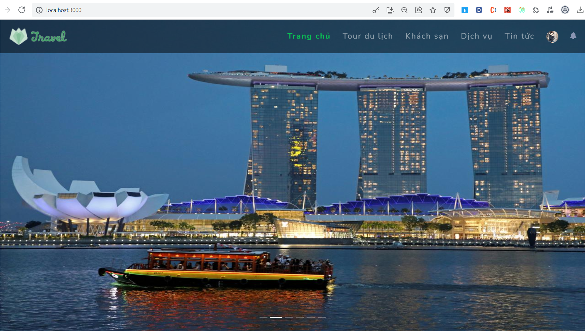
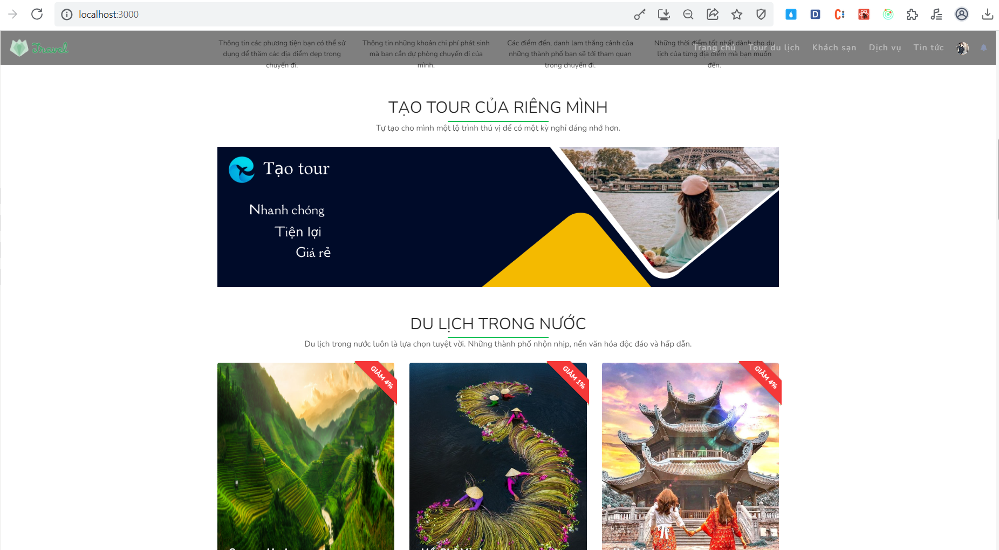
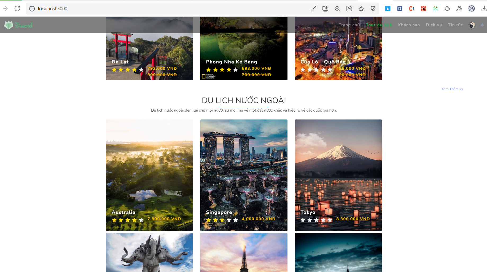
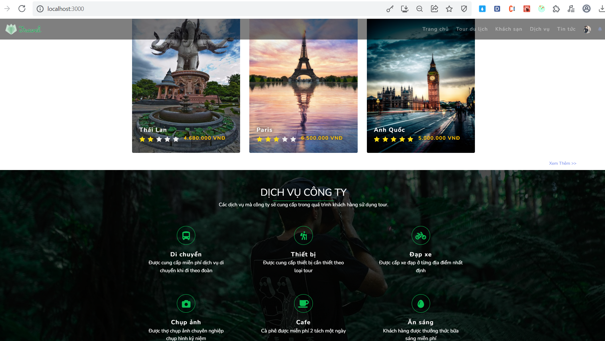
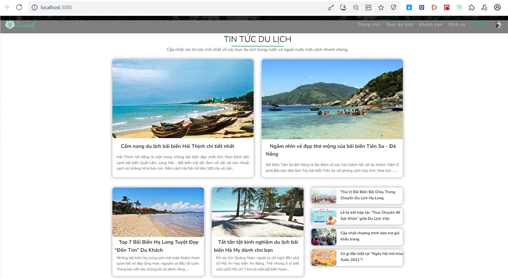
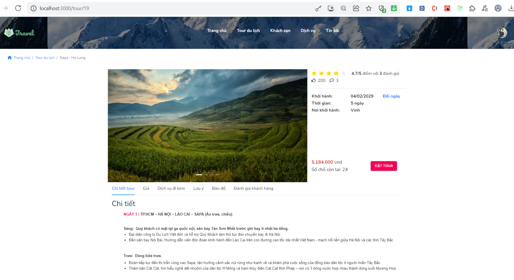
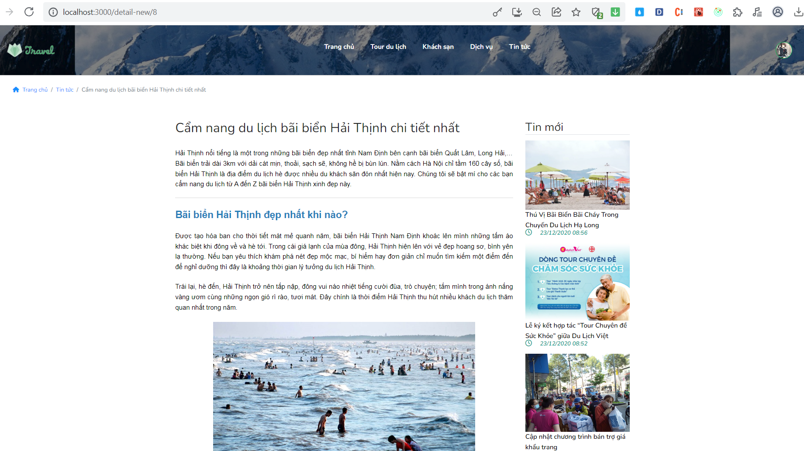
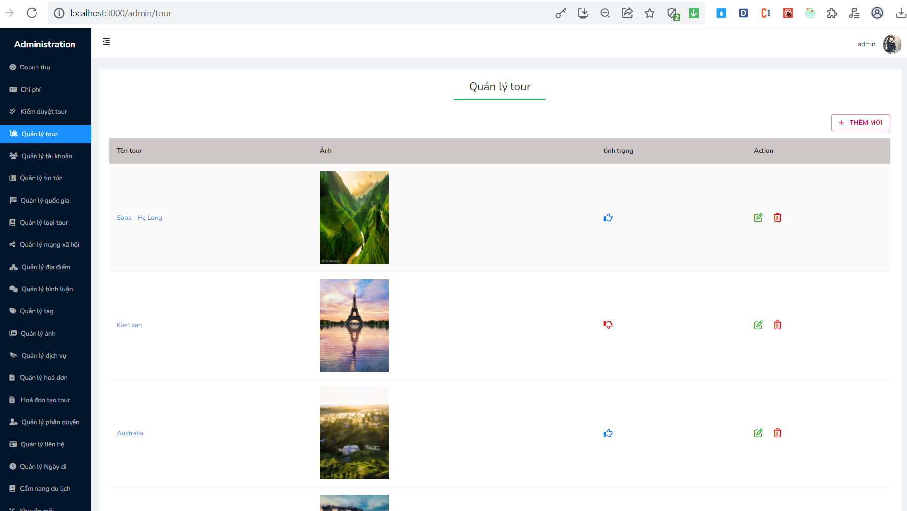
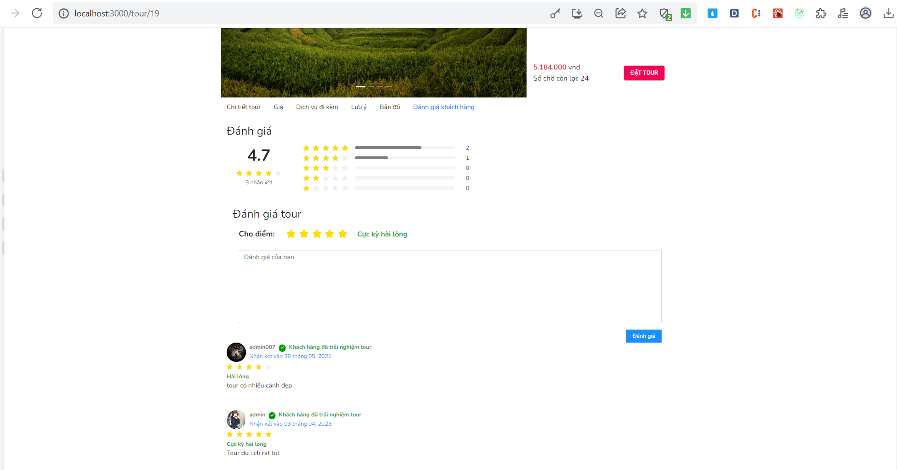
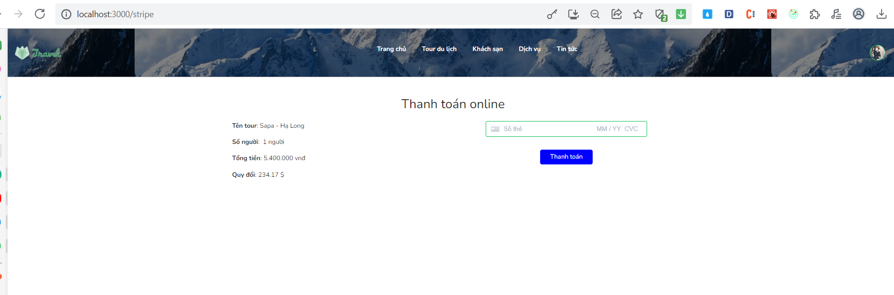

# Introduction Booking Tour

## Technologies Used:

- Frontend: HTML, CSS (SCSS), Javascript, Ant-design, Redux-toolkit
- Backend: NodeJS (Express)
- Database: MySQL

## Description of main function:

- User can register/login/logout account
- Booking tour, Search tour, Reviews and ratings tour
- Online payment (stripe)
- Read travel news, blog
- CRUD tour, news, ...
- Manage comments, user, payment, ...

## Some image from my website:

